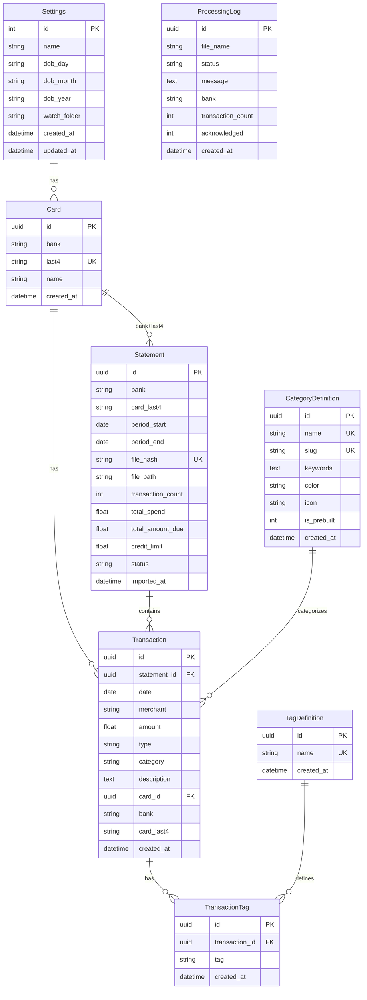
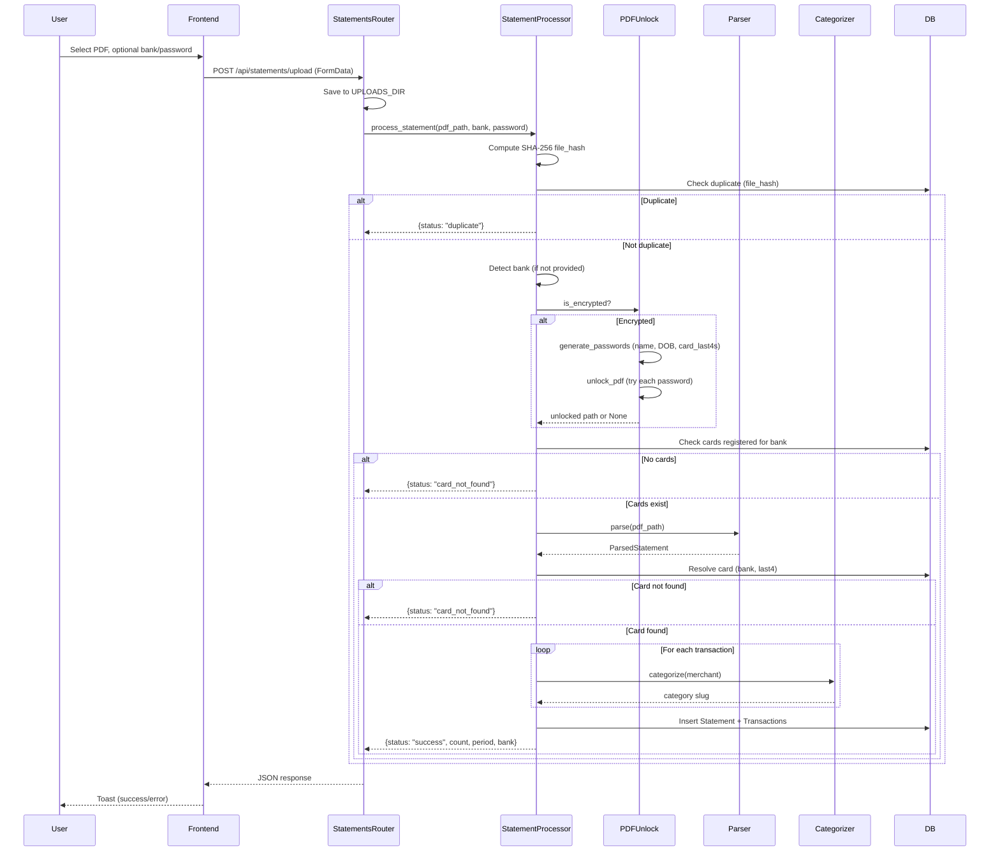
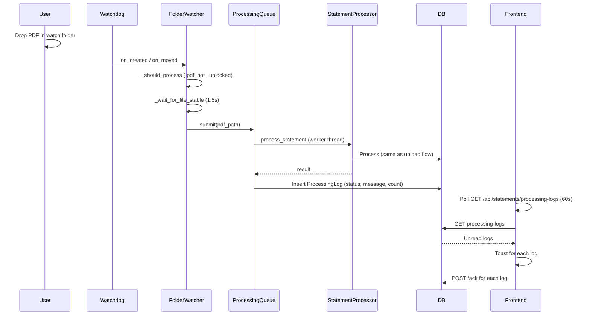
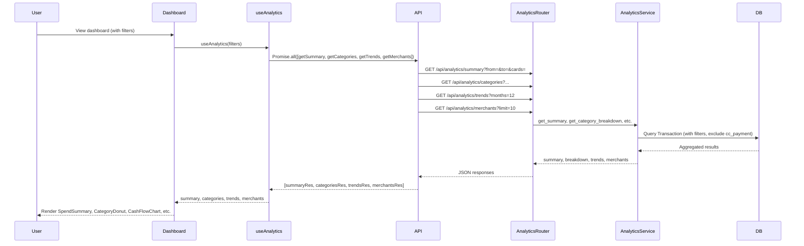
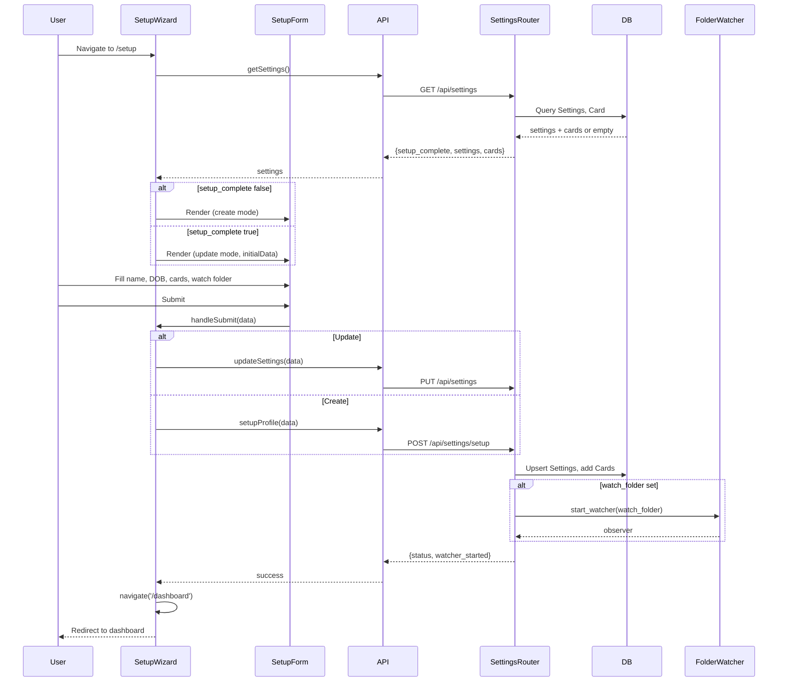
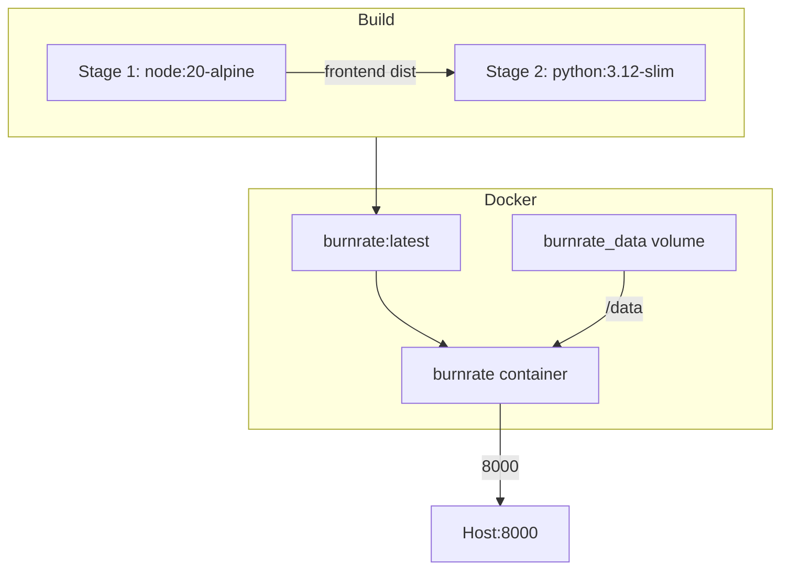
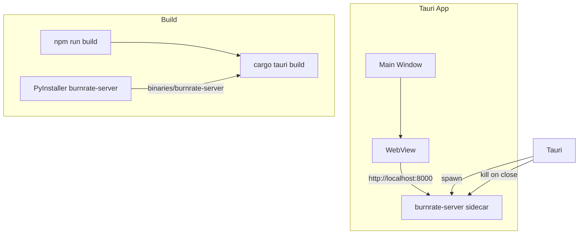

# Burnrate Architecture Document

**Version:** 0.2.0  
**Last Updated:** March 2026

Burnrate is a **privacy-first, local-first** credit card and bank statement analytics application. Core spend data and parsing stay on the user's machine—no cloud sync and no telemetry. **Core analytics** do not call third-party APIs. Optional **Gmail read-only** autosync is documented in [docs/plans/gmail-autosync.md](plans/gmail-autosync.md) and uses `/api/gmail/*` only after the user connects OAuth. Bank account statements are ingested as CSV with a `source` dimension (`CC` | `BANK`); see [docs/plans/bank-statements.md](plans/bank-statements.md).

---

## Table of Contents

1. [System Overview](#1-system-overview)
2. [Data Flow Diagrams](#2-data-flow-diagrams)
3. [Entity Relationship Diagram](#3-entity-relationship-diagram)
4. [API Endpoint Documentation](#4-api-endpoint-documentation)
5. [Frontend Component Tree](#5-frontend-component-tree)
6. [Sequence Diagrams](#6-sequence-diagrams)
7. [Edge Cases and Error Handling](#7-edge-cases-and-error-handling)
8. [Database Schema](#8-database-schema)
9. [Deployment Architecture](#9-deployment-architecture)
10. [Security Architecture](#10-security-architecture)

---

## 1. System Overview

### 1.1 Tech Stack

| Layer | Technology |
|-------|-------------|
| Backend | Python 3.12, FastAPI, SQLAlchemy 2.x, SQLite (WAL mode), Uvicorn |
| Frontend | React 18, TypeScript, Vite 6, styled-components, @cred/neopop-web, lucide-react, recharts |
| Desktop | Tauri v2 (macOS/Windows wrapper, spawns Python server as sidecar) |
| PDF | pdfplumber, pikepdf |
| Testing | pytest, Playwright |
| CI/CD | GitHub Actions |
| Packaging | Docker, Homebrew, PyInstaller, Inno Setup, Tauri DMG |

### 1.2 High-Level Architecture

```
┌─────────────────────────────────────────────────────────────────────────────────┐
│                           BURNRATE SYSTEM ARCHITECTURE                            │
└─────────────────────────────────────────────────────────────────────────────────┘

  ┌──────────────────────────────────────────────────────────────────────────────┐
  │                         DESKTOP (Tauri) / BROWSER                              │
  │  ┌─────────────────────────────────────────────────────────────────────────┐  │
  │  │  React SPA (Vite)                                                        │  │
  │  │  • Dashboard, Transactions, Analytics, Cards, Customize, SetupWizard    │  │
  │  │  • FilterContext (global filter state)                                   │  │
  │  │  • useApi hooks (settings, transactions, analytics, cards)              │  │
  │  │  • Axios client → /api/*                                                 │  │
  │  └─────────────────────────────────────────────────────────────────────────┘  │
  └──────────────────────────────────────────────────────────────────────────────┘
                                          │
                                          │ HTTP (localhost:8000)
                                          ▼
  ┌──────────────────────────────────────────────────────────────────────────────┐
  │                         FASTAPI BACKEND (Uvicorn)                              │
  │  ┌─────────────┐ ┌─────────────┐ ┌─────────────┐ ┌─────────────────────────┐  │
  │  │ Security    │ │ CORS        │ │ SPA         │ │ Static Files            │  │
  │  │ Headers     │ │ Middleware  │ │ Fallback    │ │ /assets/*               │  │
  │  └─────────────┘ └─────────────┘ └─────────────┘ └─────────────────────────┘  │
  │                                                                                │
  │  ┌─────────────────────────────────────────────────────────────────────────┐  │
  │  │ ROUTERS: /api/settings | /api/cards | /api/statements | /api/transactions │  │
  │  │          /api/analytics | /api/categories | /api/tags | /api/gmail/*     │  │
  │  └─────────────────────────────────────────────────────────────────────────┘  │
  │                                                                                │
  │  ┌─────────────────────────────────────────────────────────────────────────┐  │
  │  │ SERVICES                                                                  │  │
  │  │ • statement_processor  (unlock → parse → categorize → persist)           │  │
  │  │ • processing_queue    (ThreadPoolExecutor, max 10 workers)                │  │
  │  │ • folder_watcher      (Watchdog Observer, auto-import PDFs)              │  │
  │  │ • pdf_unlock          (pikepdf, bank-specific password generation)       │  │
  │  │ • categorizer         (keyword-based merchant → category)                 │  │
  │  │ • analytics           (net spend, breakdowns, trends, merchants)           │  │
  │  └─────────────────────────────────────────────────────────────────────────┘  │
  │                                                                                │
  │  ┌─────────────────────────────────────────────────────────────────────────┐  │
  │  │ PARSERS (bank-specific + generic)                                        │  │
  │  │ HDFC | ICICI | Axis | Federal | Indian Bank | Generic                     │  │
  │  └─────────────────────────────────────────────────────────────────────────┘  │
  └──────────────────────────────────────────────────────────────────────────────┘
                                          │
                                          │ SQLAlchemy ORM
                                          ▼
  ┌──────────────────────────────────────────────────────────────────────────────┐
  │                         SQLite (WAL mode)                                      │
  │  DATA_DIR/tuesday.db  |  UPLOADS_DIR (statement PDFs)                          │
  └──────────────────────────────────────────────────────────────────────────────┘

  ┌──────────────────────────────────────────────────────────────────────────────┐
  │ TAURI SIDECAR (Desktop only): burnrate-server (PyInstaller binary)             │
  │ • Spawned on app start, killed on window close                                │
  │ • Listens on 127.0.0.1:8000                                                  │
  │ • WebView loads http://localhost:8000, reloads on "Application startup complete"│
  └──────────────────────────────────────────────────────────────────────────────┘
```

### 1.3 Component Layout

```
burnrate/
├── backend/
│   ├── main.py              # FastAPI app, lifespan, CORS, SPA fallback, security headers
│   ├── config.py            # Bank password hints, merchant category keyword mappings
│   ├── models/
│   │   ├── database.py      # SQLAlchemy engine, SessionLocal, init_db, DATA_DIR, UPLOADS_DIR
│   │   └── models.py        # ORM: Settings, Card, Statement, Transaction, TransactionTag,
│   │                        #      CategoryDefinition, TagDefinition, ProcessingLog
│   ├── parsers/
│   │   ├── base.py          # Base parser interface (abstract)
│   │   ├── detector.py      # Bank detection from filename/BIN/PDF text
│   │   ├── generic.py       # Fallback generic parser
│   │   ├── hdfc.py, icici.py, axis.py, federal.py, indian_bank.py
│   ├── routers/
│   │   ├── analytics.py     # Summary, categories, trends, merchants, statement periods
│   │   ├── cards.py         # Card CRUD
│   │   ├── categories.py    # Category definitions, recategorize
│   │   ├── settings.py      # Settings, watch folder, folder browser
│   │   ├── statements.py    # Upload, bulk upload, reparse, delete, processing logs
│   │   ├── tags.py          # Tag definitions
│   │   └── transactions.py  # Transaction list, CSV export, tags
│   └── services/
│       ├── analytics.py     # Net spend, category breakdown, monthly trends, top merchants
│       ├── categorizer.py   # Keyword-based transaction categorization
│       ├── folder_watcher.py # Watchdog for auto-importing PDFs
│       ├── pdf_unlock.py    # PDF decryption with pikepdf
│       ├── processing_queue.py # ThreadPoolExecutor (max 10) for statement processing
│       └── statement_processor.py # Orchestrates: unlock → parse → categorize → persist
├── frontend-neopop/
│   └── src/
│       ├── App.tsx          # Root: routing, FilterProvider
│       ├── main.tsx         # React DOM entry
│       ├── pages/            # Dashboard, Transactions, Analytics, Cards, Customize, SetupWizard
│       ├── components/      # StatUpload, FilterModal, CategoryDonut, TransactionRow, etc.
│       ├── contexts/FilterContext.tsx
│       ├── hooks/useApi.ts
│       └── lib/              # api.ts, types.ts, utils.ts
├── src-tauri/               # Tauri v2 desktop wrapper
├── apps-script/Code.gs      # Google Apps Script for Gmail statement download
├── tests/                   # conftest.py, test_api.py, test_parsers.py, test_browser.py
├── scripts/                 # build-macos.sh, burnrate.iss, launch.py
├── Dockerfile               # Multi-stage: Node frontend + Python runtime
├── docker-compose.yml
└── requirements.txt
```

---

## 2. Data Flow Diagrams

### 2.1 Statement Upload and Processing Flow

```
┌──────────┐     POST /api/statements/upload      ┌──────────────┐
│ Frontend │ ──────────────────────────────────► │ Statements   │
│ (StatUpload)                                   │ Router       │
└──────────┘     FormData: file, bank?, password? └──────┬───────┘
                                                         │
                                                         │ Save to UPLOADS_DIR
                                                         │ (uuid_hex_basename.pdf)
                                                         ▼
                                              ┌──────────────────────┐
                                              │ process_statement()  │
                                              │ (statement_processor) │
                                              └──────────┬───────────┘
                                                         │
    ┌────────────────────────────────────────────────────┼────────────────────────────────────────────────────┐
    │                                                    │                                                      │
    ▼                                                    ▼                                                      ▼
┌─────────────┐                              ┌─────────────────────┐                              ┌─────────────┐
│ Compute     │                              │ Detect bank         │                              │ Check       │
│ SHA-256     │                              │ (filename/BIN/PDF)  │                              │ duplicate   │
│ file_hash   │                              └──────────┬──────────┘                              │ (file_hash) │
└─────────────┘                                         │                                         └─────┬───────┘
                                                        │                                               │
                                                        ▼                                               │ duplicate?
                                              ┌─────────────────────┐                                  │
                                              │ Encrypted?          │                                  │
                                              │ → unlock_pdf()      │                                  │
                                              │   (pikepdf)         │                                  │
                                              └──────────┬──────────┘                                  │
                                                         │                                               │
                                                         ▼                                               │
                                              ┌─────────────────────┐                                  │
                                              │ Parse (bank parser   │                                  │
                                              │ or GenericParser)   │                                  │
                                              └──────────┬──────────┘                                  │
                                                         │                                               │
                                                         ▼                                               │
                                              ┌─────────────────────┐                                  │
                                              │ Resolve card        │                                  │
                                              │ (Card.bank+last4)   │                                  │
                                              └──────────┬──────────┘                                  │
                                                         │                                               │
                                                         ▼                                               │
                                              ┌─────────────────────┐                                  │
                                              │ Categorize each txn  │                                  │
                                              │ (keyword match)     │                                  │
                                              └──────────┬──────────┘                                  │
                                                         │                                               │
                                                         ▼                                               │
                                              ┌─────────────────────┐                                  │
                                              │ Persist Statement   │                                  │
                                              │ + Transactions      │                                  │
                                              └─────────────────────┘                                  │
                                                         │                                               │
                                                         └───────────────────────────────────────────────┘
                                                                  Return {status, count, period, bank}
```

### 2.2 Watch Folder Auto-Import Flow

```
┌─────────────────┐                    ┌──────────────────────┐
│ User drops PDF  │                    │ Watchdog Observer    │
│ in watch folder │ ── on_created ──►  │ (recursive)          │
└─────────────────┘    on_moved        └──────────┬───────────┘
                                                  │
                                                  │ _should_process:
                                                  │ • .pdf suffix
                                                  │ • exclude _unlocked
                                                  ▼
                                        ┌──────────────────────┐
                                        │ _wait_for_file_stable│
                                        │ (size stable 1.5s)   │
                                        └──────────┬───────────┘
                                                  │
                                                  ▼
                                        ┌──────────────────────┐
                                        │ processing_queue     │
                                        │ .submit(pdf_path)    │
                                        │ (max 10 concurrent)  │
                                        └──────────┬───────────┘
                                                  │
                                                  ▼
                                        ┌──────────────────────┐
                                        │ process_statement()  │
                                        │ (same as upload)     │
                                        └──────────┬───────────┘
                                                  │
                                                  ▼
                                        ┌──────────────────────┐
                                        │ ProcessingLog        │
                                        │ (status, message,    │
                                        │  transaction_count) │
                                        └──────────┬───────────┘
                                                  │
                                                  ▼
                                        ┌──────────────────────┐
                                        │ Frontend polls       │
                                        │ /processing-logs     │
                                        │ → toast notifications│
                                        └──────────────────────┘
```

### 2.3 Analytics Query Flow

```
┌──────────────┐     GET /api/analytics/summary     ┌─────────────────┐
│ Dashboard    │     GET /api/analytics/categories  │ Analytics       │
│ Analytics    │ ──► GET /api/analytics/trends   ──►│ Router          │
│ page         │     GET /api/analytics/merchants   └────────┬────────┘
└──────────────┘     ?from=&to=&cards=&categories=  └────────┬────────┘
                                                             │
                                                             ▼
                                              ┌──────────────────────────────┐
                                              │ analytics service            │
                                              │ • compute_net_spend()        │
                                              │ • get_summary()              │
                                              │ • get_category_breakdown()   │
                                              │ • get_monthly_trends()       │
                                              │ • get_top_merchants()        │
                                              └──────────────┬───────────────┘
                                                             │
                                                             │ Net spend formula:
                                                             │ sum(debits) - sum(credits)
                                                             │ WHERE category != 'cc_payment'
                                                             ▼
                                              ┌──────────────────────────────┐
                                              │ Transaction table            │
                                              │ + filters: cards, dates,      │
                                              │   categories, tags, amount  │
                                              └──────────────────────────────┘
```

---

## 3. Entity Relationship Diagram



---

## 4. API Endpoint Documentation

All endpoints are prefixed with `/api`. Base URL for frontend: `/api`.

### 4.1 Settings

| Method | Path | Description |
|--------|------|-------------|
| GET | `/settings` | Get settings and cards, or `{setup_complete: false}` |
| POST | `/settings/setup` | Create settings + cards (one-time setup) |
| PUT | `/settings` | Update settings and optionally add cards |
| POST | `/settings/browse-folder` | Open native folder picker, return path |

**GET /settings Response:**
```json
{
  "setup_complete": true,
  "settings": {
    "id": 1,
    "name": "John Doe",
    "dob_day": "09",
    "dob_month": "02",
    "dob_year": "1999",
    "watch_folder": "/path/to/statements",
    "created_at": "2026-01-01T00:00:00",
    "updated_at": "2026-01-01T00:00:00"
  },
  "cards": [
    {"id": "uuid", "bank": "hdfc", "last4": "8087", "name": null}
  ]
}
```

**POST /settings/setup Request:**
```json
{
  "name": "John Doe",
  "dob_day": "09",
  "dob_month": "02",
  "dob_year": "1999",
  "watch_folder": "/path/to/statements",
  "cards": [
    {"bank": "hdfc", "last4": "8087", "name": null}
  ]
}
```

**POST /settings/setup Response:**
```json
{
  "status": "success",
  "message": "Setup complete",
  "watcher_started": true
}
```

### 4.2 Cards

| Method | Path | Description |
|--------|------|-------------|
| GET | `/cards` | List all cards |
| DELETE | `/cards/{card_id}` | Delete card and cascade to statements/transactions |

**GET /cards Response:**
```json
[
  {"id": "uuid", "bank": "hdfc", "last4": "8087", "name": null}
]
```

### 4.3 Statements

| Method | Path | Description |
|--------|------|-------------|
| POST | `/statements/upload` | Upload single PDF (FormData: file, bank?, password?) |
| POST | `/statements/upload-bulk` | Upload multiple PDFs (FormData: files[], bank?, password?) |
| GET | `/statements` | List all statements |
| DELETE | `/statements/{statement_id}` | Delete statement and cascade |
| POST | `/statements/{statement_id}/reparse` | Reparse from stored file_path |
| POST | `/statements/reparse-all` | Queue all statements for reparse |
| GET | `/statements/processing-logs` | Get unread processing logs (?unread_only=true) |
| POST | `/statements/processing-logs/{log_id}/ack` | Acknowledge log |

**POST /statements/upload Response (success):**
```json
{
  "status": "success",
  "count": 35,
  "period": {"start": "2026-01-01", "end": "2026-01-31"},
  "bank": "hdfc"
}
```

**POST /statements/upload Response (duplicate):**
```json
{
  "status": "duplicate",
  "message": "Statement already imported",
  "count": 0,
  "period": null,
  "bank": null
}
```

**POST /statements/upload-bulk Response:**
```json
{
  "status": "ok",
  "input_total": 6,
  "total": 5,
  "success": 3,
  "failed": 0,
  "duplicate": 1,
  "card_not_found": 0,
  "parse_error": 1,
  "password_needed": 0,
  "skipped": 1,
  "rejected": [
    { "file_name": "readme.md", "reason": "invalid_type" }
  ],
  "outcomes": [
    { "file_name": "jan.pdf", "status": "success", "message": null },
    { "file_name": "feb.pdf", "status": "duplicate", "message": "Statement already imported" }
  ]
}
```

`input_total` counts multipart parts; `total` is files queued after validation. `rejected` lists pre-queue skips (`missing_filename`, `invalid_type`, `file_too_large`). `outcomes` has one row per queued file (completion order). See `docs/specs/issue-16-bulk-upload-feedback.md`.

**GET /statements Response:**
```json
[
  {
    "id": "uuid",
    "bank": "hdfc",
    "card_last4": "8087",
    "period_start": "2026-01-01",
    "period_end": "2026-01-31",
    "transaction_count": 35,
    "total_spend": 45000.0,
    "total_amount_due": 45000.0,
    "credit_limit": 100000.0,
    "status": "success",
    "imported_at": "2026-03-01T12:00:00"
  }
]
```

### 4.4 Transactions

| Method | Path | Description |
|--------|------|-------------|
| GET | `/transactions` | List transactions with filters |
| GET | `/transactions/{id}/tags` | Get tags for transaction |
| PUT | `/transactions/{id}/tags` | Replace tags (max 3, 10 chars each) |

**GET /transactions Query Params:**
- `card`, `cards` (comma-separated UUIDs)
- `from`, `to` (date)
- `category`, `search`, `tags` (comma-separated)
- `direction` (incoming | outgoing)
- `amount_min`, `amount_max`
- `limit` (1-500, default 100), `offset`

**GET /transactions Response:**
```json
{
  "transactions": [
    {
      "id": "uuid",
      "statementId": "uuid",
      "date": "2026-01-15",
      "merchant": "SWIGGY",
      "amount": 450.0,
      "type": "debit",
      "category": "food",
      "description": null,
      "bank": "hdfc",
      "cardLast4": "8087",
      "cardId": "uuid",
      "tags": ["work"]
    }
  ],
  "total": 150,
  "totalAmount": 45000.0
}
```

**PUT /transactions/{id}/tags Request:**
```json
{"tags": ["work", "reimbursable"]}
```

### 4.5 Analytics

| Method | Path | Description |
|--------|------|-------------|
| GET | `/analytics/summary` | Total spend, delta %, sparkline, card breakdown |
| GET | `/analytics/categories` | Category breakdown with amounts and % |
| GET | `/analytics/trends` | Monthly trends (?months=12) |
| GET | `/analytics/merchants` | Top merchants (?limit=10) |
| GET | `/analytics/statement-periods` | Statement periods with net spend |

**Common Query Params:** `from`, `to`, `cards`, `categories`, `tags`, `direction`, `amount_min`, `amount_max`

**GET /analytics/summary Response:**
```json
{
  "totalSpend": 45000.0,
  "deltaPercent": 12,
  "deltaLabel": "vs last month",
  "period": "This month",
  "sparklineData": [{"value": 12000}, {"value": 15000}, {"value": 18000}],
  "cardBreakdown": [
    {"bank": "hdfc", "last4": "8087", "amount": 30000, "count": 25}
  ],
  "creditLimit": 100000.0,
  "avgMonthlySpend": 42000.0,
  "monthsInRange": 1
}
```

**GET /analytics/categories Response:**
```json
{
  "breakdown": [
    {"category": "food", "amount": 8000, "percentage": 17.8, "count": 45}
  ]
}
```

### 4.6 Categories

| Method | Path | Description |
|--------|------|-------------|
| GET | `/categories/all` | All categories (prebuilt + custom) |
| POST | `/categories/custom` | Create custom category (max 20) |
| PUT | `/categories/{id}` | Update category |
| DELETE | `/categories/custom/{id}` | Delete custom category only |
| POST | `/categories/recategorize` | Re-categorize all transactions |

### 4.7 Tags

| Method | Path | Description |
|--------|------|-------------|
| GET | `/tags` | List tag definitions |
| POST | `/tags` | Create tag (max 20) |
| DELETE | `/tags/{id}` | Delete tag |

---

## 5. Frontend Component Tree

```mermaid
graph TD
    subgraph App
        App[App.tsx]
        Router[BrowserRouter]
        FilterProvider[FilterProvider]
        ToastContainer[ToastContainer]
        ProcessingLogWatcher[ProcessingLogWatcher]
        Routes[Routes]
    end

    App --> Router
    Router --> FilterProvider
    FilterProvider --> ToastContainer
    FilterProvider --> ProcessingLogWatcher
    FilterProvider --> Routes

    Routes --> RootRedirect[RootRedirect]
    Routes --> SetupWizard[SetupWizard]
    Routes --> Dashboard[Dashboard]
    Routes --> Cards[Cards]
    Routes --> Transactions[Transactions]
    Routes --> Analytics[Analytics]
    Routes --> Customize[Customize]

    subgraph SetupWizard
        SetupForm[SetupForm]
    end

    subgraph Dashboard
        Navbar[Navbar]
        SpendSummary[SpendSummary]
        StatUpload[StatUpload]
        CardWidget[CardWidget]
        CashFlowChart[CashFlowChart]
        TransactionRow[TransactionRow]
        FilterModal[FilterModal]
    end

    subgraph Transactions
        FilterModal2[FilterModal]
        TransactionRow2[TransactionRow]
    end

    subgraph Analytics
        SpendSummary2[SpendSummary]
        CategoryDonut[CategoryDonut]
        CashFlowChart2[CashFlowChart]
        TopMerchants[TopMerchants]
    end

    subgraph Customize
        CategoryList[CategoryList]
        TagList[TagList]
    end

    subgraph Shared Components
        CreditCardVisual[CreditCardVisual]
        CommandSearch[CommandSearch]
        DateRangePicker[DateRangePicker]
        CloseButton[CloseButton]
        InsightCard[InsightCard]
    end
```

### Component Responsibilities

| Component | Purpose |
|-----------|---------|
| **App** | Root routing, FilterProvider, ProcessingLogWatcher (polls /processing-logs) |
| **RootRedirect** | Redirects to /dashboard if setup complete, else /setup |
| **SetupWizard** | One-time setup or profile update; SetupForm for name, DOB, cards, watch folder |
| **Dashboard** | SpendSummary, StatUpload, CardWidget, CashFlowChart, recent transactions |
| **Transactions** | Full transaction list with FilterModal, pagination |
| **Analytics** | CategoryDonut, CashFlowChart, TopMerchants, statement periods |
| **Cards** | Card list, add/delete cards |
| **Customize** | Category definitions, tag definitions, recategorize |
| **FilterModal** | Date range, cards, categories, tags, amount, direction |
| **FilterContext** | Global filter state consumed by Dashboard, Transactions, Analytics |

---

## 6. Sequence Diagrams

### 6.1 Statement Upload and Processing



### 6.2 Watch Folder Auto-Import



### 6.3 Analytics Query Flow



### 6.4 Setup Wizard Flow



---

## 7. Edge Cases and Error Handling

### 7.1 Statement Processing

| Edge Case | Handling |
|-----------|----------|
| **Duplicate file (same SHA-256)** | Return `{status: "duplicate"}` immediately; no parse |
| **File not found** | Return `{status: "error", message: "File not found"}` |
| **Encrypted PDF, wrong password** | Try manual password first; then generated passwords; return `{status: "error", message: "Could not unlock PDF"}` |
| **Bank not detected** | Return `{status: "error", message: "Could not detect bank"}` |
| **No cards registered for bank** | Return `{status: "card_not_found", message: "Add card in Settings"}` |
| **Card not in registered list** | Return `{status: "card_not_found", message: "Card ...XXXX not added"}` |
| **Multiple cards, parser can't determine** | Return `{status: "card_not_found", message: "Multiple cards registered"}` |
| **Parse returns 0 transactions, no period** | Persist Statement with `status="parse_error"`; return `{status: "parse_error"}`; file_hash prevents re-import |
| **File too large (>50 MB)** | HTTP 413 |
| **Non-PDF file** | HTTP 400 "PDF file required" |
| **SQLite lock (concurrent processing)** | processing_queue retries up to 3 times with backoff |

### 7.2 Watch Folder

| Edge Case | Handling |
|-----------|----------|
| **Watch path doesn't exist** | `start_watcher` returns None; log warning |
| **File still being written** | `_wait_for_file_stable` waits up to 15s; if timeout, process anyway with warning |
| **Unlocked temp file** | Skip files with `_unlocked` in stem |
| **Initial scan** | `_initial_scan` runs in daemon thread; dedup via file_hash in process_statement |
| **macOS case sensitivity** | `_resolve_true_case` resolves path components to true filesystem case |

### 7.3 Analytics

| Edge Case | Handling |
|-----------|----------|
| **No transactions in range** | Return 0 for totalSpend, empty breakdown |
| **Division by zero (delta %)** | `prev_spend > 0` check; else delta = 0 |
| **Invalid date params** | FastAPI validation; 422 on invalid format |
| **SQL LIKE injection (search)** | `_escape_like` escapes `%`, `_`, `\` in search term |

### 7.4 Setup Wizard

| Edge Case | Handling |
|-----------|----------|
| **Setup already completed** | POST /setup returns 400 "Setup already completed. Use PUT" |
| **Settings not found on PUT** | 404 "Use POST /setup first" |
| **Folder picker cancelled** | Returns `{path: ""}` |
| **Folder picker timeout** | 120s timeout; empty path on exception |

### 7.5 Categories & Tags

| Edge Case | Handling |
|-----------|----------|
| **Max 20 custom categories** | 400 "Maximum 20 custom categories allowed" |
| **Max 20 tags** | 400 "Maximum 20 tags allowed" |
| **Duplicate category name/slug** | 400 "Category with this name or slug already exists" |
| **Update prebuilt category name** | 400 "Cannot change name of prebuilt category" |
| **Delete prebuilt category** | 400 "Cannot delete prebuilt categories" |
| **Transaction tags > 3** | 400 "Maximum 3 tags allowed" |
| **Tag name > 10 chars** | Truncated to 10 |

---

## 8. Database Schema

### 8.1 Tables and Columns

| Table | Column | Type | Constraints |
|-------|--------|------|-------------|
| **settings** | id | INTEGER | PK, autoincrement |
| | name | VARCHAR(255) | NOT NULL |
| | dob_day | VARCHAR(2) | |
| | dob_month | VARCHAR(2) | |
| | dob_year | VARCHAR(4) | |
| | watch_folder | VARCHAR(1024) | |
| | created_at | DATETIME | default utcnow |
| | updated_at | DATETIME | onupdate utcnow |
| **cards** | id | VARCHAR(36) | PK, uuid4 |
| | bank | VARCHAR(50) | NOT NULL |
| | last4 | VARCHAR(4) | NOT NULL |
| | name | VARCHAR(255) | |
| | created_at | DATETIME | |
| | | | UNIQUE(bank, last4) |
| **statements** | id | VARCHAR(36) | PK |
| | bank | VARCHAR(50) | NOT NULL |
| | card_last4 | VARCHAR(4) | |
| | period_start | DATE | |
| | period_end | DATE | |
| | file_hash | VARCHAR(64) | NOT NULL (SHA-256) |
| | file_path | VARCHAR(1024) | |
| | transaction_count | INTEGER | default 0 |
| | total_spend | FLOAT | default 0 |
| | total_amount_due | FLOAT | |
| | credit_limit | FLOAT | |
| | status | VARCHAR(20) | default "success" |
| | imported_at | DATETIME | |
| **transactions** | id | VARCHAR(36) | PK |
| | statement_id | VARCHAR(36) | FK → statements.id ON DELETE CASCADE |
| | date | DATE | NOT NULL |
| | merchant | VARCHAR(512) | NOT NULL |
| | amount | FLOAT | NOT NULL |
| | type | VARCHAR(20) | NOT NULL (debit/credit) |
| | category | VARCHAR(50) | NOT NULL |
| | description | TEXT | |
| | card_id | VARCHAR(36) | FK → cards.id |
| | bank | VARCHAR(50) | |
| | card_last4 | VARCHAR(4) | |
| | created_at | DATETIME | |
| **transaction_tags** | id | VARCHAR(36) | PK |
| | transaction_id | VARCHAR(36) | FK → transactions.id ON DELETE CASCADE |
| | tag | VARCHAR(12) | NOT NULL |
| | created_at | DATETIME | |
| **category_definitions** | id | VARCHAR(36) | PK |
| | name | VARCHAR(50) | NOT NULL, UNIQUE |
| | slug | VARCHAR(50) | NOT NULL, UNIQUE |
| | keywords | TEXT | default "" |
| | color | VARCHAR(9) | default "#9CA3AF" |
| | icon | VARCHAR(50) | default "MoreHorizontal" |
| | is_prebuilt | INTEGER | default 0 |
| | created_at | DATETIME | |
| **tag_definitions** | id | VARCHAR(36) | PK |
| | name | VARCHAR(12) | NOT NULL, UNIQUE |
| | created_at | DATETIME | |
| **processing_logs** | id | VARCHAR(36) | PK |
| | file_name | VARCHAR(512) | NOT NULL |
| | status | VARCHAR(20) | NOT NULL |
| | message | TEXT | |
| | bank | VARCHAR(50) | |
| | transaction_count | INTEGER | default 0 |
| | acknowledged | INTEGER | default 0 |
| | created_at | DATETIME | |

### 8.2 SQLite Pragmas

```sql
PRAGMA foreign_keys=ON;
PRAGMA journal_mode=WAL;
PRAGMA busy_timeout=5000;
```

### 8.3 Indexes (Implicit)

- Primary keys: indexed by SQLite
- Unique constraints: `cards(bank, last4)`, `category_definitions(name)`, `category_definitions(slug)`, `tag_definitions(name)`
- Foreign keys: `transactions.statement_id`, `transactions.card_id`, `transaction_tags.transaction_id`

### 8.4 Data Directory Layout

```
DATA_DIR/                    # BURNRATE_DATA_DIR or ./data or ~/Library/Application Support/burnrate
├── tuesday.db               # SQLite database
├── tuesday.db-wal            # WAL file
├── tuesday.db-shm            # WAL shared memory
└── uploads/                 # Uploaded statement PDFs
    └── {uuid_hex}_{original_name}.pdf
```

---

## 9. Deployment Architecture

### 9.1 Docker



- **Multi-stage build:** Node builds frontend → Python runtime with static files
- **Environment:** `BURNRATE_STATIC_DIR=/app/static`, `BURNRATE_DATA_DIR=/data`
- **Volume:** `/data` for persistence
- **Port:** 8000
- **User:** Non-root `appuser`
- **Healthcheck:** `GET /api/settings` every 30s

**Run:**
```bash
docker-compose up -d
# Access at http://localhost:8000
```

### 9.2 Tauri (macOS Desktop)



- **Sidecar:** PyInstaller binary `burnrate-server` spawned with `--host 127.0.0.1 --port 8000`
- **WebView:** Loads `http://localhost:8000`; reloads when "Application startup complete" in stdout
- **Bundle:** DMG for macOS (targets: app, dmg)
- **Data dir:** `~/Library/Application Support/burnrate` (platformdirs)

### 9.3 Homebrew (macOS)

- Install via `brew install burnrate` (tap)
- Uses same PyInstaller/Tauri build artifacts
- Data in `~/Library/Application Support/burnrate`

### 9.4 PyInstaller + Inno Setup (Windows)

- **PyInstaller:** Bundles Python + frontend dist into `Burnrate/` directory
- **Inno Setup:** Creates `Burnrate-Setup.exe` installer
- **Data dir:** `%APPDATA%/burnrate` (platformdirs when frozen)

### 9.5 Source (Development)

```bash
# Terminal 1: Backend
cd burnrate && python -m uvicorn backend.main:app --reload --port 8000

# Terminal 2: Frontend (dev)
cd frontend-neopop && npm run dev  # Vite on 5173

# Or Tauri dev (spawns backend, loads dev URL)
cargo tauri dev  # Uses devUrl: http://localhost:5173
```

- **Data dir:** `./data` (project-local)
- **CORS:** localhost:5173, 5174, 6006, 6007

---

## 10. Security Architecture

### 10.1 Security Headers (Middleware)

| Header | Value |
|--------|-------|
| X-Content-Type-Options | nosniff |
| X-Frame-Options | DENY |
| X-XSS-Protection | 1; mode=block |
| Referrer-Policy | strict-origin-when-cross-origin |

### 10.2 CORS

- **Allowed origins:** `http://localhost:5173`, `5174`, `6006`, `6007` (dev only)
- **Credentials:** true
- **Methods/Headers:** * (permissive for local dev)

### 10.3 Path Validation

- **Upload filenames:** Sanitized with `PurePosixPath(file.filename).name`; stored as `{uuid4().hex}_{basename}` to prevent path traversal
- **SPA fallback:** `requested.resolve()` checked to ensure path stays within `_static_root_resolved` before serving files
- **Watch folder:** `Path(watch_path).expanduser().resolve()`; must exist and be directory

### 10.4 Input Sanitization

| Input | Sanitization |
|-------|--------------|
| **Search (transactions)** | `_escape_like` escapes `%`, `_`, `\` for SQL LIKE |
| **Card last4** | Truncated to last 4 chars: `last4[-4:]` |
| **Bank** | Lowercased |
| **Tag names** | Trimmed, max 10 chars, max 3 per transaction |
| **Category keywords** | Stored as-is; matched case-insensitively |
| **File upload** | Max 50 MB; PDF extension required |

### 10.5 Authentication

- **None.** Burnrate is local-only. The backend binds to `127.0.0.1` (or `0.0.0.0` in Docker). No user accounts, no API keys.
- **Assumption:** Only the machine owner has access to localhost. For Docker, ensure the container is not exposed to untrusted networks.

### 10.6 Sensitive Data

- **DOB, name:** Used only for PDF password generation; never logged or transmitted
- **PDF passwords:** Generated in-memory; never persisted
- **Statement files:** Stored in `UPLOADS_DIR`; consider encrypting at rest for high-sensitivity deployments

### 10.7 Dependency Security

- **Python:** `pip install -r requirements.txt`; pin versions in production
- **Node:** `npm ci`; lockfile for reproducible builds
- **Rust:** `Cargo.lock` for Tauri dependencies

---

## Appendix: Supported Banks

| Bank | Parser | Detection |
|------|--------|-----------|
| HDFC | HDFCParser | Filename, BIN (5522, 4386, etc.), PDF text |
| ICICI | ICICIParser | Filename, BIN, PDF text |
| Axis | AxisParser | Filename, BIN, PDF text |
| Federal | FederalBankParser | Filename, PDF text |
| Indian Bank | IndianBankParser | Filename, PDF text |
| SBI, Amex, IDFC, etc. | GenericParser | Filename, PDF text |

---

*This document is the authoritative reference for Burnrate architecture. Update when making significant changes to the system.*
